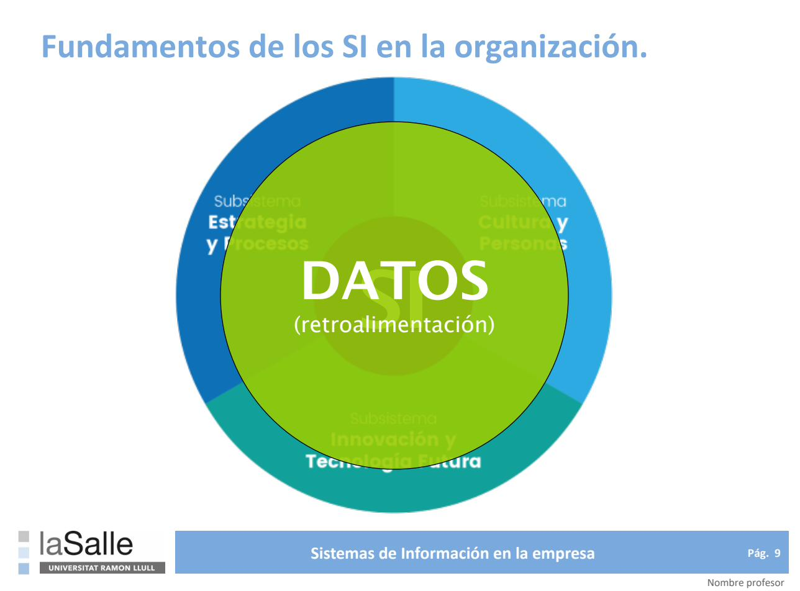
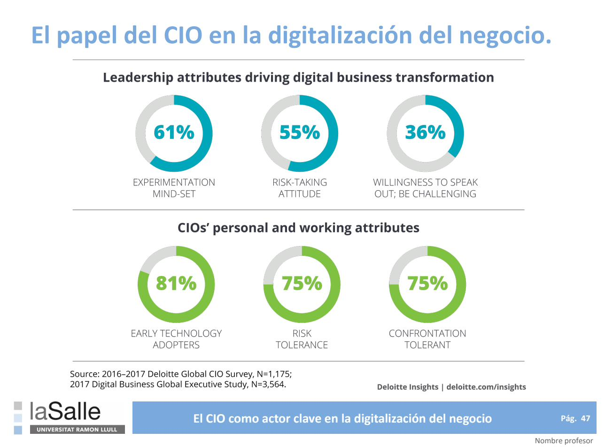
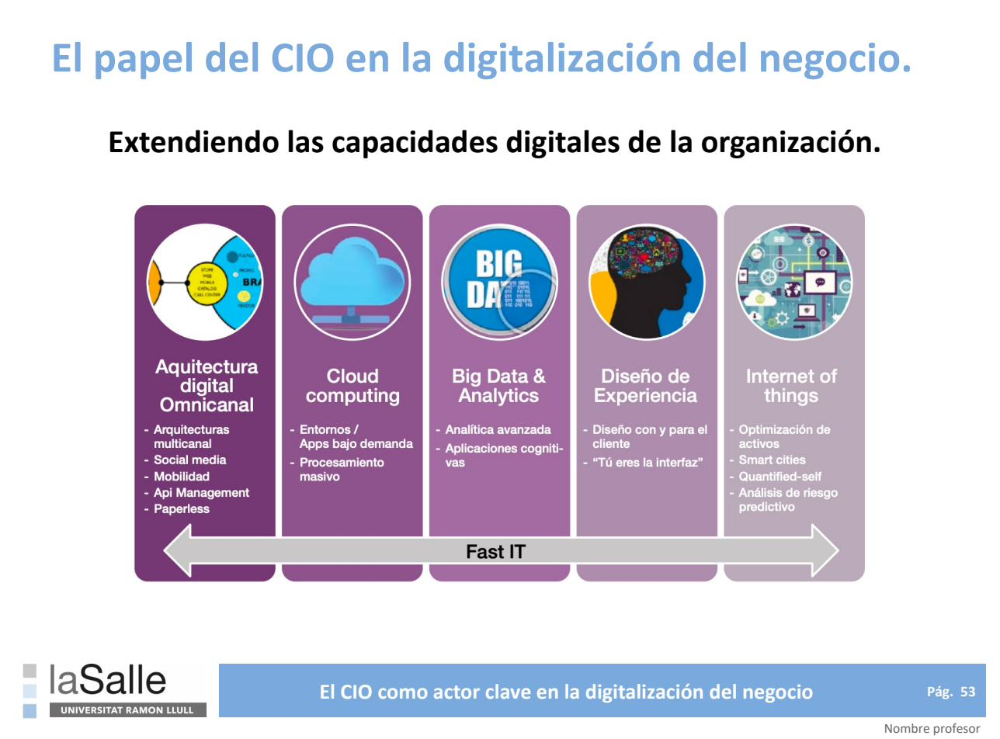
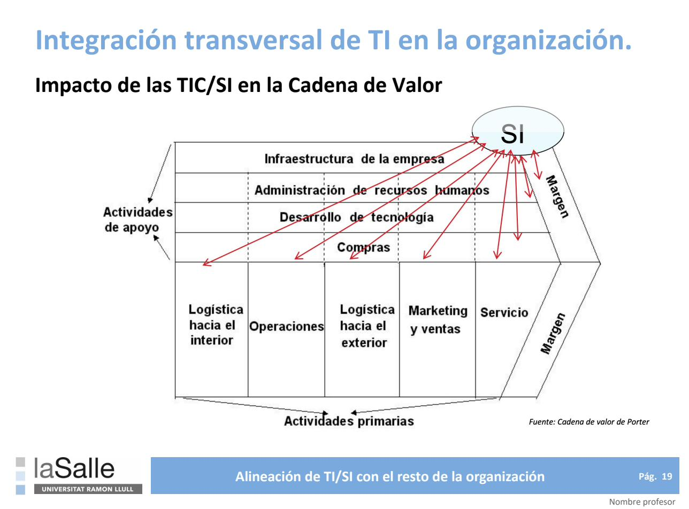
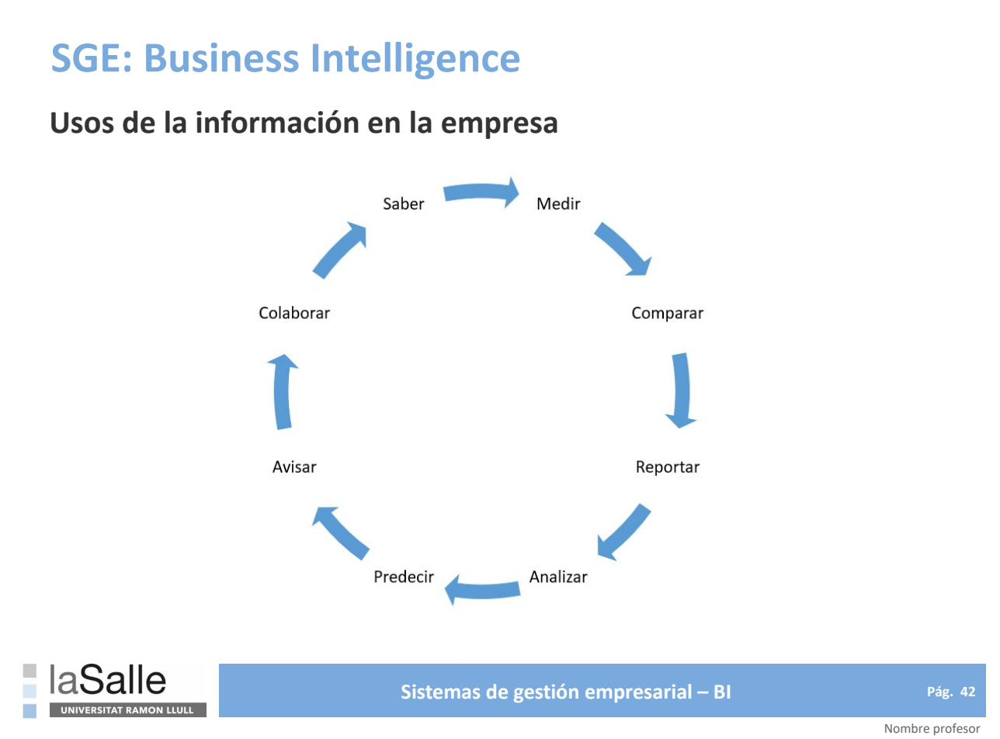
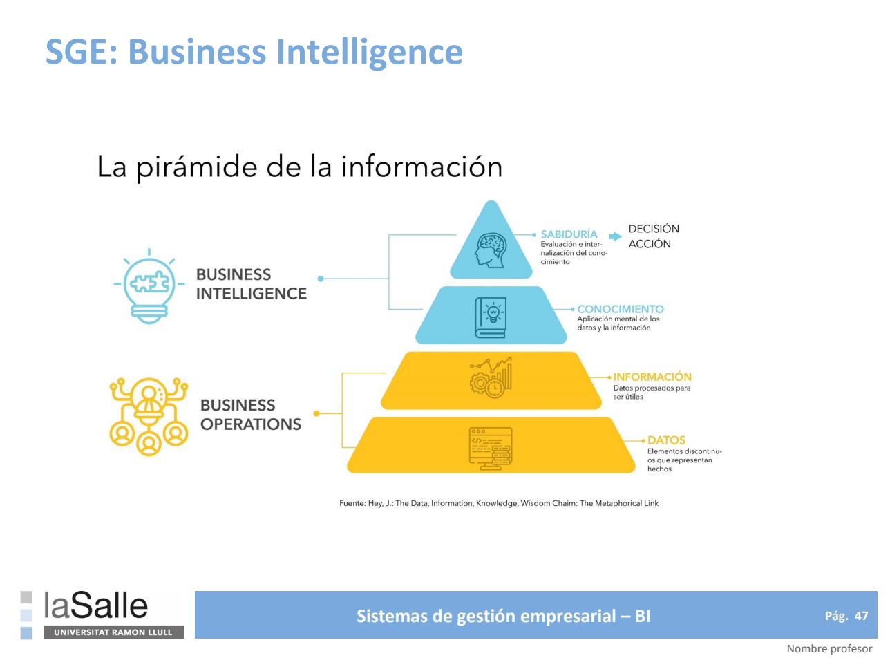
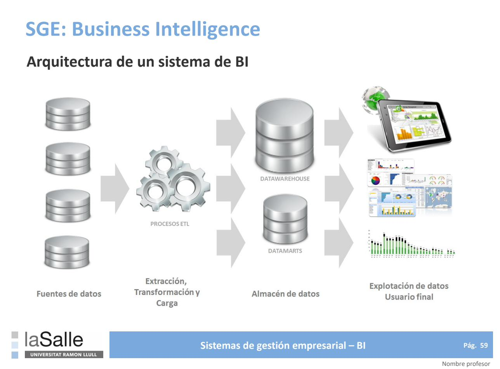
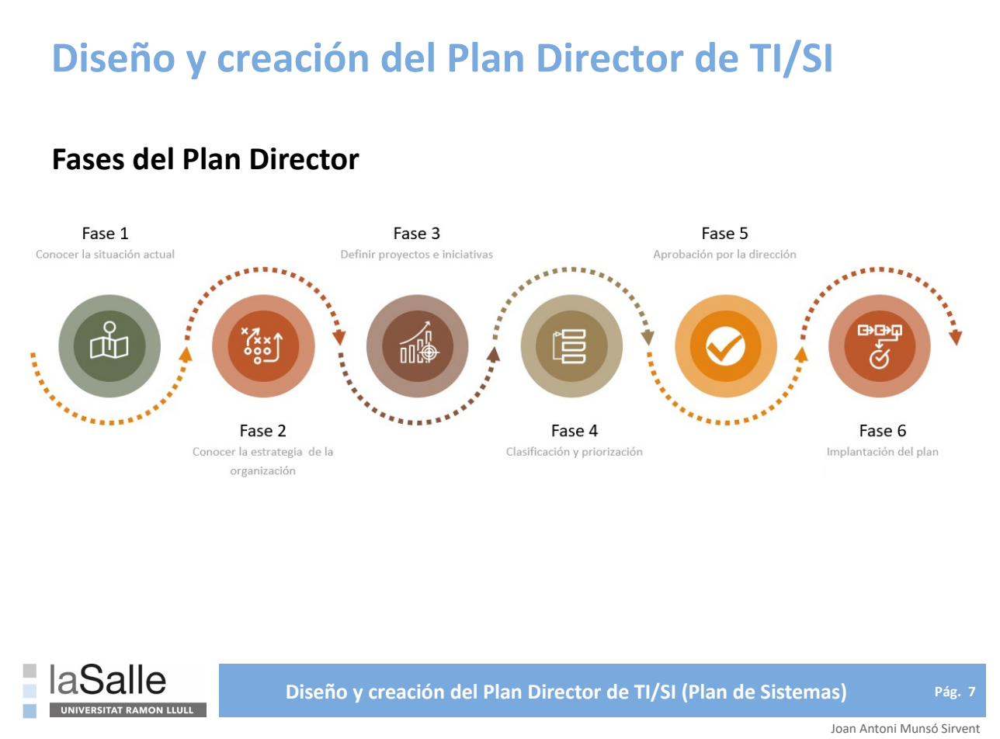
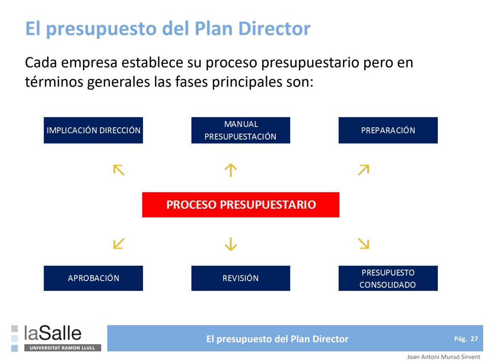

# Gestión de Sistemas de Información (M0064)
### Master Universitario en Dirección Tecnológica — La Salle (Curso 2024-2025)
**Documento maestro de referencia** — consolida el Plan de Trabajo, la Guía Académica y las ocho sesiones (S1–S8) de la asignatura, más el contenido relevante de la bibliografía recomendada, verificado y ampliado con fuentes externas actuales. Sustituye a los PDF originales como documento de consulta único.

---

## 0. Ficha de la asignatura

| Campo | Detalle |
|---|---|
| Créditos ECTS | 5 |
| Temporalidad | Semestre 1 |
| Titulación | Master Universitario en Dirección Tecnológica |
| Código | M0064 |
| Modalidad | Presencial |
| Idioma | Español |
| Profesor | Joan Antoni Munsó Sirvent — CIO en Mesoestetic Pharma Group; miembro del Consejo de CIOs de Cataluña (CIOs.cat); comité fundador de Digital2Business (Cambra de Comerç de Barcelona); Master Executive Business Innovation y Master en Dirección de las TIC (La Salle BES); Programa superior en Liderazgo Estratégico (Universidad Nebrija) |

### Competencias evaluadas
- **CB7-CB9** (básicas): resolución de problemas en contextos nuevos/multidisciplinares; formulación de juicios con información incompleta considerando implicaciones éticas y sociales; comunicación clara de conclusiones a públicos especializados y no especializados.
- **G2-G3** (transversales): integración de conocimientos en entornos poco conocidos; aplicación de responsabilidad ética, legislación y deontología profesional a la gestión de las TIC.
- **E1, E3, E4, E5, E8** (específicas): aplicación de principios de gestión empresarial y estrategia en el uso de nuevas tecnologías; identificación de propuestas de valor tecnológicas; formulación de propuestas de uso de la tecnología para ventaja competitiva; análisis del mercado TIC y su entorno económico-legislativo; identificación de tendencias y retos tecnológicos para la innovación.

### Objeto de la asignatura
Los SI/TIC han dejado de ser una función de soporte para convertirse en un factor decisivo de la estrategia, el desarrollo y el crecimiento del negocio, en un entorno competitivo, cambiante y globalizado ("hacer más con menos"). La ventaja competitiva exige alinear los SI/TI con la estrategia de negocio mediante un **Plan de Sistemas** (Plan Director) que cubra las necesidades a corto y largo plazo. El CIO debe gestionar las TIC y los SI con criterios de negocio y anticiparse a las necesidades de la empresa; el CEO y los directores funcionales deben, a su vez, entender los SI/TI que sostienen la empresa actual.

### Metodología y evaluación
- 8 sesiones agrupadas en **3 ejes de conocimiento**. Cada sesión combina exposición docente con ejercicios individuales/grupales.
- Evaluación: **3 trabajos** (uno por eje), cuya nota media determina la calificación final. Integridad académica exigida (normativa de copias: `https://blogs.salleurl.edu/es/normativa-de-copias`); el uso de IA (p. ej. ChatGPT) debe documentarse.

---

## 1. Estructura de la asignatura — 3 ejes / 8 sesiones

| Eje | Sesiones | Contenido |
|---|---|---|
| **1. Estrategia del dep. de SI/TI en la organización** | S1, S2, S3 | Fundamentos y evolución de los SI · Alineación de TI/SI con el negocio · Modelo organizativo del departamento de TI/SI |
| **2. Diseño e implantación de los SI en la organización** | S4, S5, S6 | Sistemas de Información empresariales (ERP/CRM/BI) · SI asociados a la gestión de SI (PMO/SMO) · Estrategia competitiva de las TIC |
| **3. Dirección de SI a través del Plan Director** | S7, S8 | El Plan Director de SI · Gestión del presupuesto de TI/SI · Presentación de un caso (Business Case) |

---

## 2. Sesión 1 — Fundamentos y evolución de los SI en la empresa

### 2.1 Fundamentos
La información es uno de los activos más valiosos de la organización: sustenta la gestión propia, la toma de decisiones y el análisis estratégico para mejorar el rendimiento.

**Sistema de Información (SI):** conjunto de recursos de la compañía que sirve de soporte al proceso de captación, transformación y comunicación de la información. Debe ser:
- **Eficaz** — si facilita la información precisa.
- **Eficiente** — si lo hace con la menor cantidad de recursos posible.

**Cuatro actividades de un SI:**
1. **Recopilación** — datos en bruto, internos y externos.
2. **Almacenamiento** — conservación de la información recopilada.
3. **Procesamiento** — ordenación y estructuración de la entrada.
4. **Distribución** — transferencia de la información procesada a quien la necesita.

Ningún SI se implanta desde cero: toda organización ya cuenta con algún sistema, más o menos eficaz/eficiente.

### 2.2 Evolución histórica de los SI
| Década | Enfoque | A quién ayuda |
|---|---|---|
| 1950-60 | Procesamiento de datos (transacciones cotidianas) | Trabajadores |
| 1960-70 | Informes de gestión pre-especificados | Gerentes intermedios |
| 1970-80 | Apoyo a las decisiones (soporte ad-hoc) | Gerentes senior |
| 1980-90 | Apoyo ejecutivo (información interna/externa estratégica) | Ejecutivos |
| 1990-2000 | Gestión del conocimiento | Toda la empresa |
| 2000-presente | E-Business (conectividad e integración total) | Comercio electrónico global |

### 2.3 Clasificación de los SI
- **MIS** (Management Information System) — información de interés para la gerencia.
- **TPS** (Transaction Processing System) — almacena y procesa transacciones comerciales.
- **DSS** (Decision Support System) — combina y estudia datos para decisiones concretas.
- **EIS** (Executive Information System) — información para metas estratégicas.
- **GDSS** (Group Decision Support System) — decisiones compartidas en equipo.
- **EDSS** (Expert Decision Support System) — actúan como consultores expertos.
- **Sistemas estratégicos** — ventaja competitiva mediante tecnología.
- **Sistema de Información de Marketing** — promoción/venta y desarrollo de producto.
- **ERP** (Enterprise Resource Planning) — sistemas integrales que recogen datos de producción, logística, ventas, contabilidad y proyectos para mejorar la gestión, reducir costes y plazos, y aumentar la competitividad.

**Modelo visual del SI (S1, pág. 9):** el sistema de información se representa como tres subsistemas — *Estrategia y Procesos*, *Cultura y Personas*, *Innovación y Tecnología Futura* — que convergen sobre un núcleo de **Datos**, con un bucle de **retroalimentación** continua.



### 2.4 Factores clave de éxito de un SI
- **Calidad de la información:** complejidad, fiabilidad, exactitud, consistencia.
- **Satisfacción del usuario:** velocidad, accesibilidad, visualización, personalización, precisión.
- **Agilidad = Visualización:** profundidad de las conclusiones, velocidad de interpretación, eficacia al compartir datos.

Riesgo habitual: adoptar tecnologías como soluciones puntuales sin estrategia de escalado ("la tecnología está por todas partes, el valor no").

### 2.5 Empresas líderes en tecnología: mejores resultados financieros
Según Accenture (*Future Systems* — `accenture.com/es-es/insights/future-systems/future-ready-enterprise-systems`), las empresas con enfoque tecnológico estratégico doblan el crecimiento medio de ingresos frente a las rezagadas. Rasgos de los "líderes":
- **Sistemas sin límites:** la nube como punto de partida, arquitecturas flexibles e interoperables, eliminación de capas innecesarias del stack de TI, nuevos modelos de negocio.
- **Sistemas adaptables:** arquitecturas flexibles, uso de IA/automatización/Blockchain/microservicios para resolver fricciones, IA responsable, decisiones guiadas por datos.
- **Sistemas radicalmente humanos:** diseño centrado en las personas, ruptura de barreras organizativas/culturales, experimentación temprana con tecnologías emergentes.
- Datos: adopción de IA al 98% (líderes) vs. 42% (rezagados); 95% ve la nube como catalizador de innovación vs. 30%; 90% garantiza la calidad del dato; 73% usa aprendizaje experimental vs. 24%.

### 2.6 Las TIC como agente del cambio
- Forrester Research: el 70% de las empresas de la lista Fortune 1000 de 2010 ya han desaparecido — la causa principal es la incapacidad de adaptarse al cambio.
- Más del 30% de las empresas carecen aún de plan de digitalización a corto plazo; para más del 80% gestionar grandes volúmenes de datos sigue siendo un reto.
- Causas de "parálisis": desconexión cultural sobre lo digital, mentalidad de recorte de gastos vs. inversión en innovación, silos departamentales, foco excesivo en obstáculos internos (seguridad, cumplimiento normativo).
- Palancas para superarla: liderazgo convencido desde el comité de dirección, sistema único de flujos interconectados, salir de la zona de confort, cliente en el centro, cultura de innovación, visión compartida entre departamentos.
- Áreas de influencia de la transformación digital: visión/cultura/liderazgo, talento digital, digitalización de procesos, marketing digital, cliente (customer centric), modelos de negocio digital (eCommerce), infraestructura (cloud), ciberseguridad, analítica de datos.
- Tecnologías influyentes: Blockchain, ciberseguridad, RPA, marketing digital, BI/Big Data, realidad virtual/aumentada, IA.

### 2.7 El CIO como actor clave en la digitalización
- **"El iceberg digital":** la parte visible son las herramientas orientadas al usuario; la parte sumergida —de la que el CIO es responsable— son las capacidades, la arquitectura y la infraestructura que las sostienen.
- Solo el **34%** de los CIO afirma desempeñar hoy un papel realmente estratégico en su organización (Encuesta global de CIO 2018-2019). Riesgos: confundir "lo digital" con la estrategia empresarial (la digitaliza­ción *apoya*, no *sustituye*, a la estrategia); expectativas desalineadas entre funciones de negocio.

**Atributos de liderazgo digital (Deloitte Global CIO Survey 2016-2017, N=1.175; Digital Business Global Executive Study 2017, N=3.564):** mentalidad de experimentación (61%), disposición a asumir riesgos (55%), disposición a cuestionar/ser desafiante (36%); y como atributos personales del propio CIO: adoptante temprano de tecnología (81%), tolerancia al riesgo (75%), tolerancia a la confrontación (75%).



**Extensión de las capacidades digitales de la organización (S1, pág. 53):** cinco palancas con las que el CIO amplía el alcance de "Fast IT" — arquitectura digital omnicanal (multicanal, social, movilidad, API management, paperless), cloud computing (entornos/apps bajo demanda, procesamiento masivo), Big Data & Analytics (analítica avanzada, aplicaciones cognitivas), diseño de experiencia (diseño centrado en cliente) e Internet of Things (optimización de activos, smart cities, quantified-self, análisis predictivo).


- Roles del CIO como líder digital:
  - **Impulsar la estrategia** — liderar o contribuir a las estrategias digitales, comprender el contexto de negocio, liderar iniciativas de innovación.
  - **Construir ecosistemas** — mentalidad de capital riesgo, alianzas, inversión en capacidades más allá de los recursos internos.
  - **Transformar el negocio** — gestionar el cambio cultural en TI y en toda la empresa.
- Tres acciones del CIO: manejar el ritmo de la aceleración tecnológica, implantar herramientas que faciliten el cambio, digitalizar procesos.
- Resumen: "Lo digital no es una iniciativa, es una forma de pensar"; el CIO debe ejercer un papel estratégico, desarrollar soluciones innovadoras, liderar la transformación digital, acompañar a los directores de departamento y ejercer de consejero del CEO.

---

## 3. Sesión 2/3 — Alineación de TI/SI con el negocio y modelo organizativo

### 3.1 Evolución de las TIC en su alineación con el negocio
La dependencia tecnológica crece con la necesidad de eficiencia. Las TIC dejaron de ser solo hardware/red para convertirse en el vehículo de la ventaja competitiva. Riesgo: la complejidad y la interconexión hacen que incidentes antes confinados a TI ahora afecten a todo el negocio (pérdida de datos, brechas de seguridad, fallos de infraestructura → impacto en productividad, reputación y objetivos estratégicos).

**¿Qué es (y qué NO es) una estrategia de TI?**
| Es | No es |
|---|---|
| Decidir con el mayor conocimiento posible del negocio, mercado y clientes | Un conjunto de técnicas o normas |
| Organizar sistemáticamente recursos (personas, financieros, técnicos) | Un conjunto de tecnologías |
| Medir resultados frente a expectativas | Una certificación |
| — | Gestionar equipos |

**Metas del Plan de TI:** alinear la visión de TI con la del negocio, mejorar la comunicación TI-negocio, planificar el flujo de información, gestionar TI como activo de la organización.

**Disparadores para crear/actualizar el Plan de TI:** nuevo plan de negocio, fusiones, pérdida de competitividad, cambio en la gerencia de TI, aplicaciones que no soportan el cambio de procesos, adopción forzada de un "package" corporativo, backlog creciente de proyectos sin cerrar, downsizing.

### 3.2 Alineación transversal con el resto de la organización
Pasos: (1) entender la organización y el negocio (objetivos, prioridades, procesos, DAFO); (2) desarrollar orientación a procesos; (3) identificar la Cadena de Valor; (4) analizar el impacto de las TIC en procesos y cadena de valor.

**Cadena de Valor:** conjunto de actividades que añaden valor al cliente. Rompe la visión departamental: el foco no es el producto ni el departamento, es el cliente. Facilitadores TIC/SI del rediseño de procesos: bases de datos corporativas, telecomunicaciones/Internet, sistemas expertos/IA, ERP, CRM, herramientas colaborativas, terminales de identificación, workflow.

**Impacto de las TIC/SI en la Cadena de Valor de Porter (S4, pág. 19):** el SI se conecta transversalmente tanto a las actividades de apoyo (infraestructura de la empresa, RRHH, desarrollo de tecnología, compras) como a las actividades primarias (logística de entrada/salida, operaciones, marketing y ventas, servicio), siendo el elemento que enlaza todo el esquema y contribuye al margen.



### 3.3 Los SI y la competitividad
**Tipos de estrategia competitiva:** liderazgo en costes, diferenciación, innovación, crecimiento, alianzas estratégicas.

Evolución del rol de la TI en la competitividad: 70-80 (soporte) → 90 (recurso estratégico) → siglo XXI (integrada en la estrategia desde el origen). La TI reduce costes en toda la cadena de valor y mejora la diferenciación (personalización). Palancas de ventaja competitiva vía SI: globalidad (expansión internacional), cliente (CRM/BI), producto (innovación, coste, calidad), canal (e-business), procesos (reingeniería, ERP).

### 3.4 La innovación como impulso de las TIC
Entorno VUCA: pérdida de posicionamiento, descenso de márgenes, necesidad de agilidad y omnicanalidad. El área de TI/SI puede y debe liderar la innovación por su visión transversal y su experiencia en gestión de proyectos.

**Cinco fuerzas de Porter** aplicadas a TI/SI: negociación con clientes (digitalización de la relación), rivalidad del mercado (diferenciación tecnológica), nuevos competidores (organización flexible y ágil), negociación con proveedores (digitalización del supply chain), nuevos productos/servicios (tecnología como núcleo del servicio, no solo soporte).

**Doble rol del CIO:**
- **In Business / Utility CIO:** reducción de costes, agilización de procesos, mejora del servicio.
- **On Business / Innovation CIO:** voz e influencia en decisiones de negocio, rol estratégico, crecimiento y posición competitiva vía tecnología.

Herramientas de cultura innovadora: Design Thinking, Océano Azul, Lean Startup, Business Model Canvas.

---

## 4. Sesión 4 — Sistemas de Gestión Empresarial (ERP, CRM, BI y otros SGE)

### 4.1 Sistemas de Gestión Empresarial (SGE): concepto y beneficios
Programas para manejar políticas y procedimientos de forma eficaz (organización, calidad, objetivos, contabilidad, finanzas, productos/servicios, clientes). Beneficios: ahorro de esfuerzo y costes, mayor satisfacción, mejor clima organizacional, uso correcto de recursos, mejor desempeño financiero, información en tiempo real, menor tiempo de respuesta, sincronización de propósitos con la visión de empresa.

### 4.2 Principales SGE
| Sistema | Función |
|---|---|
| **ERP** | Integra y da soporte completo a la gestión empresarial; enlaza procesos y facilita el flujo de datos |
| **CRM** | Gestión comercial y relación con clientes (pre/postventa) |
| **SRM** (Supplier Relationship Management) | Mejora del suministro y la relación con proveedores |
| **SGA** | Gestión de almacenes |
| **DMS** | Gestión documental |
| **BPM** | Mapeo, evaluación y optimización de procesos/flujos de trabajo |
| **BI** | Análisis de información para la toma de decisiones directivas |

### 4.3 ERP en detalle
- **Definición:** software estructural que integra las operaciones de la empresa mediante una base de datos centralizada.
- **Ventajas:** automatización, disponibilidad centralizada de información, integración de bases de datos, ahorro de tiempo/costes, integración con BI.
- **Inconvenientes:** coste (a mayor personalización, mayor coste), costes ocultos post-implantación, complejidad de implementación, gestión del cambio.
- **Síntomas que indican la necesidad de un ERP:** exceso de tiempo en tareas diarias, preguntas de negocio sin respuesta, procesos que "se escapan", procesos manuales con múltiples datasets, pérdida de oportunidades por lentitud.
- **Tipos por tamaño:** pequeña empresa, PYME (escalable), gran empresa (multi-industria).
- **Tipos por instalación:** *on premise* (más control, más responsabilidad y coste de mantenimiento — típico de grandes empresas) vs. *cloud* (menos control, menor coste/mantenimiento, más rápido de adoptar).

### 4.4 CRM en detalle
Centraliza las interacciones cliente-empresa en una única base de datos; permite anticipar necesidades, gestionar campañas y disponer de cuadros de mando comerciales.

- **Por función:** operacional (automatización de ventas/marketing/servicio), analítico (minería de datos, OLAP, para empresas con flujo constante de clientes), colaborativo (comparte interacción y canales entre departamentos).
- **Por acceso:** on premise (control total, coste elevado, empresas consolidadas) vs. on demand (SaaS, pago por uso).
- **Por código:** privativo (soporte 24/7, coste) vs. open source (gratuito, requiere conocimiento técnico).
- No existe "receta única": la elección evoluciona con la madurez de la organización.

### 4.5 Business Intelligence (BI)
> "La Inteligencia de Negocio es el conjunto de estrategias y herramientas enfocadas a la administración y creación de conocimiento mediante el análisis de los datos existentes en una organización." — *Data Warehouse Institute*

**Ciclo de uso de la información en la empresa (S2, pág. 42):** Medir → Comparar → Reportar → Analizar → Predecir → Avisar → Colaborar → Saber, y de nuevo a Medir — un ciclo continuo, no lineal, que conecta la operación (Business Operations) con la inteligencia (Business Intelligence).



**Pirámide de la información — jerarquía DIKW (S2, pág. 47; fuente: Hey, J., *The Data, Information, Knowledge, Wisdom Chain*):** de la base a la cima, **Datos** (elementos discontinuos que representan hechos) → **Información** (datos procesados para ser útiles) → **Conocimiento** (aplicación mental de datos e información) → **Sabiduría** (evaluación e internalización del conocimiento, que conduce a la decisión/acción). Los dos niveles inferiores corresponden a *Business Operations*; los dos superiores, a *Business Intelligence*.



**Pirámide de decisión (datos → información → conocimiento):**
- **Nivel operativo:** información estructurada, decisiones basadas en reglas/protocolos.
- **Nivel intermedio:** información semi-estructurada, planes/previsiones/presupuestos.
- **Nivel superior:** información desestructurada, planes estratégicos, indicadores clave.

**Sistemas de información para la dirección:** MIS (informes operativos), DSS (decisiones semiestructuradas urgentes), EIS/ESS (supervisión estratégica, *dashboards*, *drill-down*).

**Arquitectura BI (3 capas):** (1) Extracción/ETL desde sistemas transaccionales (ERP) → (2) Almacenamiento/Data Warehouse → (3) Análisis y aplicaciones de gestión (cubos OLAP/MOLAP). Sistemas asociados: Master Data Management, Data Warehouse, ETL, OLAP, reporting, Balanced Scorecard, Analytics, Big Data, optimización de procesos.

**Diagrama de arquitectura (S2, pág. 59):** Fuentes de datos → Procesos ETL (extracción, transformación y carga) → Almacén de datos (Data Warehouse / Data Marts) → Explotación de datos por el usuario final (dashboards, cuadros de mando, informes móviles).



**Beneficios:** menor riesgo en decisiones, anticipación a necesidades del cliente, optimización de recursos, eficacia de procesos, reacción ante oportunidades, agilidad en el cambio de estrategia.

**Síntomas que aconsejan implantar BI:** más tiempo preparando datos que analizándolos, ausencia de datos realistas actualizados, mala comunicación de datos entre departamentos, pérdida de clientes por falta de datos a tiempo, incongruencias entre fuentes.

**Principales herramientas del mercado (2021, actualizado a 2026):** SAP BI, Tableau, Microsoft Power BI, IBM Cognos, MicroStrategy, Oracle BI, Domo. Bibliografía del curso, *Top 12 BI tools of 2021* (CIO.com, Peter Sayer y Thor Olavsrud) amplía la lista con **Board, Dundas BI, Qlik, SAS, Sisense, Tableau CRM y Tibco** — confirmando Power BI, Tableau, MicroStrategy, Oracle Analytics Cloud y Domo como constantes del mercado.

### 4.6 Caso de análisis — La Salle Business Resort (LSBR)
Hotel de 261 habitaciones con fuentes de datos dispersas (Datisa, Opera, Micros TPV, Buzón de Voz, Quadriga TV, Minibares, VingCard). Tras modernizar hardware/software (2008-2009), el reto pendiente era la **integración hacia el dato único**. La consultora **Data Consulting Group (DCG)** implantó **Oracle Business Intelligence Standard One** siguiendo: análisis de informes → diseño de Data Mart → instalación del producto BI → diseño de cuadros de mando → interfaz web (Intranet/Internet). Resultado: eliminación del tiempo de consolidación manual, informes diarios fiables, acceso por niveles/perfiles y exportación a Excel/PDF.

**Preguntas de análisis del caso (para uso en el trabajo grupal):**
1. Identificar los *key stakeholders* en la detección de la necesidad y en la definición operativa con DCG.
2. Acciones del CIO para alinear la propuesta con el resto de la organización antes de presentarla a la Dirección General.
3. Factores que podrían impedir la aprobación por Dirección General.
4. Factores clave de éxito en la presentación al comité de dirección.
5. Riesgos en la implantación y adopción del nuevo SI.
6. Elementos clave para demostrar la correcta adopción y la aportación a la cadena de valor.

---

## 5. Sesiones 6-7 — El Plan Director de TI/SI y su presupuesto

### 5.1 Qué es y para qué sirve el Plan Director
Hoja de ruta y marco de referencia que analiza la situación actual y propone acciones alineadas con las necesidades estratégicas del negocio; identifica dónde invertir en personas, proveedores, procesos y sistemas. Es la herramienta **operativa** dentro del concepto más amplio y **estratégico** del Plan de Transformación Digital.

**Objetivos:** diagnosticar la situación actual (puntos fuertes/riesgos), definir la arquitectura de información, proponer y priorizar proyectos, diseñar el calendario, evaluar recursos/presupuesto, y establecer mecanismos de seguimiento.

**Las 6 fases del Plan Director (S6/S7, pág. 7):**
1. **Conocer la situación actual.**
2. **Conocer la estrategia de la organización.**
3. **Definir proyectos e iniciativas.**
4. **Clasificación y priorización.**
5. **Aprobación por la dirección.**
6. **Implantación del plan.**



**Beneficios:** medir el desempeño/percepción de TI, alinear tecnología y negocio, mejorar la comunicación TI-negocio, maximizar el valor de los recursos de TI, gestionar riesgos, justificar costes.

**Recomendaciones prácticas:**
- Contar con el apoyo explícito de la Dirección.
- Entender bien la estrategia y necesidades del negocio.
- Centrarse en el medio plazo (**18-24 meses**) dada la rapidez de la evolución tecnológica.
- Identificar componentes clave: personas, proveedores, organización, arquitectura, presupuesto, plazos, riesgos, gobierno.
- Disponer de métricas/indicadores de seguimiento.
- **Revisar el plan cada 6 meses.**

**Componentes de un Plan Director de TI/SI:** resumen ejecutivo, información de la organización, requisitos de negocio, estado actual de los SI, benchmarking sectorial, oportunidades de mejora, objetivos/estrategia de SI, *Gap Analysis*, planificación de implementación (hoja de ruta, presupuestos, prioridades, fechas, proyectos).

**Contenido general:** información de entrada externa (estudio de mercado) e interna (estado actual), necesidades a corto (acciones del año) y a largo (acciones futuras).

### 5.2 Alineación del Plan Director
Debe considerar el resto de planes de negocio y a la dirección de la organización; requiere involucrar a dirección ejecutiva, dirección intermedia y personal clave.

- **Situación del entorno (macro):** conocer mercado, fabricantes y proveedores; suele obtenerse de otras áreas (marketing, ventas, dirección).
- **Información interna (micro-entorno):** indicadores operativos, análisis de riesgos, auditorías, plan de comunicación, presupuesto.
- **Propuesta a corto plazo:** nunca debería figurar "mantener las cosas como están"; se recomienda el uso de **OKR (Objectives Key Results)** en lugar de listas de tareas.
- **Propuesta a largo plazo:** identificar necesidades detectadas que no puedan acometerse este año, para futuras revisiones (ej. renovación de sistemas de backup).

### 5.3 Presentación del Plan Director a la Dirección General
Momento crítico para el CIO: audiencia experimentada y exigente, con la percepción extendida de que las propuestas de TI son complejas y de difícil comprensión para negocio.

**Factores imprescindibles de éxito:**
1. **Hablar en lenguaje directivo**, desde la perspectiva del negocio.
2. **Conectar con la visión general de la empresa** — no presentar el proyecto como algo aislado; resaltar los aspectos diferenciales; analizar por qué fracasaron propuestas similares anteriores.
3. **Demostrar conocimiento de los motivos y riesgos originales** del proyecto, para reforzar la confianza en el liderazgo del CIO.
4. **Presentar el proyecto como fuente de conocimiento compartido** — lecciones aprendidas, innovación, elementos incorporables al modelo de negocio (evitar el "lo que pasa en el proyecto, se queda en el proyecto").

**Consejos de estilo:**
- Averiguar qué necesita saber la audiencia (tener varias versiones de la presentación).
- No abusar de PowerPoint — usarlo como apoyo gráfico, no textual.
- Conocer el estilo de aprendizaje de la audiencia.
- Subrayar el mensaje principal al cerrar.

> Contraste con fuentes actuales (bibliografía del curso, *Relationship building/networking: How to wow your board of directors*, CIO.com): la convergencia IT/OT y la ciberseguridad han situado la tecnología entre los 2-3 temas más relevantes para los consejos de administración; se recomienda a los CIO reunirse con consejeros **fuera** de la sala de juntas y aplicar el "efecto zoom" (alternar visión estratégica y detalle operativo) para ganar credibilidad — ver *Building board relationships: The CIO's playbook* (CIO.com).

### 5.4 El presupuesto del Plan Director
Dos inputs clave: el **Plan Estratégico del negocio** (para alinear el presupuesto) y el **histórico de presupuestos** (para no olvidar gastos recurrentes ni mantener gastos innecesarios). Debe ser realista, con retorno estimado justificado ante otros departamentos (Finanzas, Marketing, Comercial, RRHH).

**Fases del proceso presupuestario (S6/S7, pág. 27):** Implicación de la Dirección → Manual de presupuestación → Preparación → Presupuesto consolidado → Revisión → Aprobación, cerrando el ciclo sobre el "Proceso presupuestario" central.



**CAPEX (inversión, activos amortizables):** servidores, ordenadores, tablets/móviles, infraestructura de telecomunicaciones, licencias nuevas.

**OPEX (gastos):** nuevos proyectos (según política de la empresa), mejoras a sistemas existentes, mantenimiento de software/licencias, suscripciones (cloud, comunicaciones, backups), repuestos, formación, arrendamientos, salarios, material de oficina, amortizaciones.

**Centros de coste:** agrupan departamentos imprescindibles para el sistema productivo (clasificación tradicional: Producción, Compras, Ventas, Administración); permiten localizar, repartir y controlar costes indirectos, y dar visibilidad de eficiencia/productividad por área.

**Proceso presupuestario:** creación del borrador (reparto mensual/trimestral + partida de contingencias) → comparación con presupuestos anteriores → aprobación definitiva.

### 5.5 Gestión y control del presupuesto de TI/SI
Tras la aprobación, se controla la ejecución comparando datos reales vs. presupuestados, detectando desviaciones (positivas o negativas) y redirigiendo recursos.

**KPIs típicos de control:**
- % presupuesto ejecutado vs. no ejecutado.
- % OPEX ejecutado por área TIC.
- % CAPEX ejecutado.
- % por centro de coste (RRHH, personal contratado, oficina, viajes, cloud, telecomunicaciones, formación…).
- % por partida CAPEX (infraestructura, desarrollo, Big Data, otros proyectos).
- ROI de proyectos clave y ROI ponderado del portfolio.

**Síntoma "siempre me falta presupuesto":** ausencia de estrategia clara (operación bajo demanda), información financiera poco fiable, presupuesto "soportado" incoherente, ausencia de proveedores *partner* estables, alta rotación de equipos, situación de crisis, falta de seguimiento anual.

**Síntoma "siempre me sobra presupuesto":** presupuestos heredados sobredimensionados, bajo control de inversiones/costes/rentabilidad, o compañía en fuerte crecimiento — en cualquier caso, revisar los supuestos de cálculo.

> Contraste con la bibliografía del curso (CIO.com, *Sharp IT budget cuts expected in wake of COVID-19* y *12 IT budget tricks to reduce costs post-COVID*): en contextos de crisis, las palancas más citadas para ajustar presupuesto sin perder capacidad son renegociar contratos con proveedores, consolidar licencias/herramientas duplicadas, migrar cargas a cloud bajo demanda (OPEX variable) y priorizar el *backlog* según impacto en continuidad de negocio antes que en innovación — principio directamente alineado con la gestión de CAPEX/OPEX y centros de coste vista en esta sesión.

---

## 6. Sesión 8 — Ejercicio Business Case: Plan Director de Sistemas de Información

**Objetivo:** demostrar los conocimientos adquiridos mediante el análisis de un caso de aplicabilidad real (empresa ficticia o real).

**Estructura orientativa del trabajo (PowerPoint, 20 min. de presentación por grupo):**
1. **Descripción general de la empresa** — estructura organizativa, tipología y modelo de negocio, situación geográfica y facturación estimada, elementos clave del plan estratégico a 3-5 años.
2. **Descripción general de TI** — estructura organizativa, equipo de gobierno, principales SI implantados, presupuesto del último ejercicio (importe, partidas, centros de coste).
3. **Plan Director para el próximo año** —
   - SI futuros (si procede).
   - Necesidades TIC clasificadas por criticidad.
   - Elementos del Plan Estratégico que sustentan la propuesta.
   - Proyectos/servicios propuestos: nombre, descripción, equipos implicados, stakeholders, riesgos, coste y tiempo estimados.
   - Resumen ejecutivo: priorización, impacto presupuestario, presupuesto total estimado.

---

## 7. Ejercicio práctico individual/grupal — Alineación de los SI al negocio (S4/S5)

Elegir un departamento (Marketing, Finanzas, RRHH, Compras, Operaciones, CAC/CAU) y desarrollar:
1. Objetivos y prioridades del departamento.
2. Implicaciones sobre los SI (necesidad y uso actual).
3. Procesos de negocio: criticidad, dependencias, coste, valor, relación entre ellos (DAFO).
4. Situación actual y futura (propuesta) de TI/SI sobre su estrategia.
5. Contribución (actual y prevista) de los SI a la ventaja competitiva.
6. Contribución (actual y prevista) de los SI a la innovación en productos/servicios.

**Extensión — prospección de mercado (S5):** identificar productos por cada SI planteado, comparar al menos una alternativa, identificar proveedores/partners, valorar el impacto del producto seleccionado sobre la estrategia definida, e identificar factores clave de éxito/fracaso en la implantación.

---

## 8. Bibliografía recomendada — contenido verificado y actualizado (2026)

> Las URLs originales de la Guía Académica se han verificado mediante búsqueda web; varias han cambiado de identificador o de titular tras 2021-2024. Se indica el enlace vigente cuando ha podido confirmarse.

1. **Information technology – what is it still good for?** (CIO.com) — plantea la tesis contraria a "IT doesn't matter" (Nicholas Carr, 2003): la TI sigue siendo fuente de ventaja competitiva cuando se usa de forma diferencial, no solo como commodity.
2. **10 signs outdated IT systems are killing your business** (CIO.com) — señales de deuda técnica que erosiona la competitividad: procesos manuales redundantes, incapacidad de escalar, incidentes de seguridad recurrentes, insatisfacción de empleados/clientes.
3. **Nine competencies that can elevate the CIO to business leader** (Deloitte) — describe las competencias que distinguen a un CIO "estratégico" de uno puramente operativo: orientación al cliente, storytelling ejecutivo, gestión del talento digital y visión de negocio de extremo a extremo.
4. **Why IT-business alignment still fails** (Minda Zetlin, CIO.com, 2018 — URL vigente: `cio.com/article/3307873/it-strategy/why-it-business-alignment-still-fails.html`) — pese a que en 2012 el 65% de +1.300 directivos creía que TI y negocio estaban alineados, la brecha persiste por diferencias de lenguaje, prioridades y métricas de éxito entre ambas partes.
5. **The 12 (hoy "8") biggest issues IT faces today** (CIO.com, actualizado 2026) — para 2026 el reto nº1 es **obtener valor tangible de la IA a escala** (superar la fase de pilotos), seguido de construir una fuerza de trabajo ágil, atraer/retener talento en IA+negocio, y gestionar un mandato de CIO cada vez más amplio (transformación, gobierno de IA, valor de negocio).
6. **La falta de coordinación entre el equipo de TI y el resto dificulta la transformación digital** (MuyComputerPro) — la desconexión entre TI y el resto de la organización es uno de los mayores frenos a la digitalización, en línea con el concepto de "silos" visto en la Sesión 1.
7. **How to run your small business with free open source software** (CIO.com) — alternativas open source viables para pymes en ERP/CRM/ofimática, reduciendo la barrera de entrada del CAPEX.
8. **18 (originalmente "10"/"16") famous ERP disasters, dustups and disappointments** (CIO.com, actualizado 2025) — catálogo de fracasos históricos de implantación ERP (Hershey, Nike, HP, Waste Management vs. SAP, entre otros) con causas comunes: gobierno de proyecto inadecuado, diseño deficiente, alcance cambiante, falta de experiencia interna, y cultura que castiga las "malas noticias" (auditorías señalan que los riesgos se ocultaban en anexos poco visibles).
9. **Top 12 BI tools of 2021** (CIO.com, Peter Sayer / Thor Olavsrud) — Board, Domo, Dundas BI, Microsoft Power BI, MicroStrategy, Oracle Analytics Cloud, Qlik, SAS, Sisense, Tableau, Tableau CRM y Tibco; confirma el listado de herramientas BI de la Sesión 2.
10. **What is ESM? When service management evolves beyond IT** (CIO.com) — el Enterprise Service Management extiende las prácticas ITSM (basadas en ITIL) a RRHH, Legal o Instalaciones, ampliando el rol de "gestión de servicios" fuera del departamento de TI.
11. **Transformación digital y desarrollo de ventajas competitivas sostenibles** (pmfarma.es) — enfocado al sector farmacéutico, conecta con el perfil profesional del docente (CIO en Mesoestetic Pharma Group).
12. **Maximizing the Return on Digital Investments** (World Economic Forum + Accenture, 2018) — estudio econométrico sobre +16.000 empresas de 14 industrias: la combinación de tecnologías digitales (no una sola) genera un incremento de productividad ~3 veces mayor; riesgo de "desigualdad industrial" porque el top 20% de empresas por productividad concentra la mayor parte de la ganancia, dejando atrás al resto.
13. **Aligning IT project and business strategies: why you should and how you can** (CIO.com) — recomendaciones prácticas de gobierno de proyectos para mantener la alineación estratégica durante todo el ciclo de vida del proyecto, no solo en su aprobación inicial.
14. **How to win over your board of directors** (CIO.com, *Relationship building/networking*) — la convergencia IT/OT y la ciberseguridad han situado a la tecnología entre los 2-3 temas más relevantes en los consejos de administración; cada vez más CIOs reportan directamente al consejo. Recomendaciones complementarias (*Building board relationships: The CIO's playbook*, Deloitte/CIO.com): reunirse con consejeros fuera de la sala de juntas y aplicar el "efecto zoom" (alternar entre visión estratégica y detalle operativo).
15. **Sharp IT budget cuts expected in wake of COVID-19** (CIO.com) — contexto histórico de contracción presupuestaria 2020; relevante como caso de estudio de gestión de crisis presupuestaria.
16. **12 IT budget tricks to reduce costs post-COVID** (CIO.com) — palancas de reducción de coste sin perder capacidad: renegociación de contratos con proveedores, consolidación de licencias, migración a modelos cloud de gasto variable (OPEX) y repriorización del backlog por impacto en continuidad de negocio.

**Recurso adicional citado en S1:** Accenture, *Future Systems — Future-ready enterprise systems* (`accenture.com/es-es/insights/future-systems/future-ready-enterprise-systems`) — base de los conceptos "sistemas sin límites / adaptables / radicalmente humanos" de la Sección 2.5 de este documento.

**Normativa académica:** `blogs.salleurl.edu/es/normativa-de-copias` (normativa de copias e integridad académica de La Salle).

---

## 9. Marco de referencia rápido para el CIO/CTO (síntesis ejecutiva)

Esta sección resume, en clave de consulta rápida, los conceptos de la asignatura que un CIO/CTO debe tener presentes al asesorar sobre Gestión de Sistemas de Información:

1. **El SI no es un fin, es un medio** — su valor se mide por la calidad de la información y la satisfacción del usuario, no por la sofisticación tecnológica.
2. **La alineación TI-negocio es un proceso continuo**, no un evento puntual: exige entender la cadena de valor, no solo los procesos internos de TI.
3. **ERP, CRM y BI son complementarios, no sustitutivos**: el ERP unifica la operativa, el CRM gestiona la relación con el cliente y el BI transforma los datos de ambos en conocimiento accionable.
4. **El Plan Director es la herramienta operativa** que traduce la estrategia de transformación digital en proyectos, calendario, presupuesto y KPIs — con revisión semestral y horizonte de 18-24 meses.
5. **El presupuesto de TI se gestiona en dos ejes (CAPEX/OPEX) y por centros de coste**, con KPIs de ejecución y ROI que permiten detectar desviaciones a tiempo.
6. **La presentación a Dirección General es un acto de comunicación estratégica**: el lenguaje debe ser el del negocio, no el de la tecnología, y el proyecto debe conectarse siempre con la visión general de la empresa.
7. **El CIO actual desempeña un doble rol** — *Utility CIO* (eficiencia operativa) e *Innovation CIO* (impulso estratégico e innovación) — y su legitimidad ante el consejo depende cada vez más de su capacidad de gestionar riesgo, ciberseguridad y valor de la IA, no solo infraestructura.
8. **La mayor causa de fracaso de los grandes proyectos de SI (ERP en particular) no es tecnológica**, sino de gobierno: alcance cambiante, falta de patrocinio ejecutivo, y culturas organizativas que penalizan reportar riesgos a tiempo.

---

*Documento generado a partir de: M0064 – Plan de Trabajo Gestión de Sistemas de Información 2024-2025; M0064 – Guía Académica Gestión de Sistemas de Información 2024-2025; S1 Los SI en la empresa; S2 ERP-CRM-BI; S3 Caso de análisis – Gestión de SI; S4 Alineando los SI con los objetivos del negocio; S5 Ejercicio de alineación de TI y propuesta de SI; S6-S7 Gestión del Plan Director y Presupuesto de TI; S8 Presentación Plan Director SI — más verificación y ampliación de la bibliografía recomendada mediante búsqueda web (septiembre 2026).*

*Incluye 9 diagramas originales extraídos de las diapositivas fuente (carpeta `/imagenes`), seleccionados por aportar información no capturable en texto: modelo de subsistemas del SI, atributos de liderazgo digital del CIO (Deloitte), capacidades digitales extendidas, ciclo de uso de la información, pirámide DIKW, arquitectura de BI, cadena de valor de Porter aplicada a TIC/SI, fases del Plan Director y fases del proceso presupuestario. Se han excluido imágenes puramente decorativas (logos, viñetas humorísticas, iconografía sin contenido informativo propio) por no aportar valor de consulta.*

---

### Convención de nomenclatura de imágenes (aplicable a todas las materias del Máster)

Para evitar colisiones de nombres al consolidar las imágenes de varias asignaturas en un mismo repositorio, toda imagen extraída sigue el patrón:

```
{CODIGO_ASIGNATURA}_S{SESION}_P{PAGINA}_{descripcion-corta-en-slug}.jpeg
```

- **CODIGO_ASIGNATURA** — código oficial de la guía académica (p. ej. `M0064`). Primer nivel de unicidad entre materias.
- **S{SESION}** — número de sesión de origen (`S1`...`S8`); si la fuente cubre varias sesiones fusionadas, se concatenan (`S6S7`).
- **P{PAGINA}** — página/diapositiva exacta del archivo fuente, dos dígitos (`P09`, `P47`) — permite volver a la fuente original si hace falta verificar el dato.
- **descripcion-corta** — 3-6 palabras en minúsculas, separadas por guiones, sin tildes ni caracteres especiales.

Ejemplo real de esta asignatura: `M0064_S1_P09_modelo-si-subsistemas.jpeg`. Esta misma convención se aplicará al resto de materias del Máster (Gestión de la Innovación, Gestión de Proyectos, Gestión de Servicios, etc.), sustituyendo `M0064` por el código correspondiente de cada guía académica.
